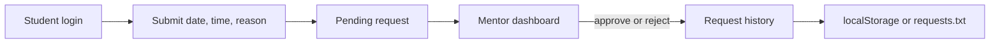

# FWD — Front-End Development Coursework

`FWD` contains front-end development exercises and two small implementations of a student gate-pass workflow:

- `Project/HTML/` — a browser application with student and mentor dashboards, localStorage persistence, request submission, and approve/reject actions.
- `Project/DSA/` — a Java console implementation using a `HashMap` for users, a `Queue` for pending requests, an `ArrayList` for stored requests, and CSV-style file persistence.

The remaining `CO1-PGMS`, `CO2-PGMS`, and `CO3-PGMS` directories contain HTML/CSS/JavaScript language and styling exercises.

## Gate-pass workflow



## Web version

The browser version is a static application; it has no server or database.

```bash
python -m http.server 5500 --directory Project/HTML
```

Open `http://localhost:5500`. Student requests and mentor decisions are stored in the browser's `localStorage`.

## Java version

Prerequisite: JDK 17 or newer.

From the repository root:

```bash
javac Project/DSA/Main.java
java -cp Project/DSA Main
```

The Java program persists request rows in `requests.txt` relative to the process working directory, loads pending requests into a FIFO queue, and lets the mentor process them in order.

## Important limitations

- Authentication is hard-coded demo data in both implementations and is not suitable for real access control.
- The web version is client-only and does not share state with the Java version.
- The Java persistence format is comma-separated text and does not escape commas in user-entered reasons.
- No automated test suite, backend service, or database is included.

## Coursework structure

```text
CO1-PGMS/              HTML fundamentals
CO2-PGMS/              CSS/layout exercises
CO3-PGMS/              JavaScript exercises
Project/HTML/          static gate-pass UI
Project/DSA/           Java console gate-pass implementation
requests.txt           sample persisted request data
```

## Author

**Karkala Shiva Reddy** — [GitHub](https://github.com/karkalashivareddy)
